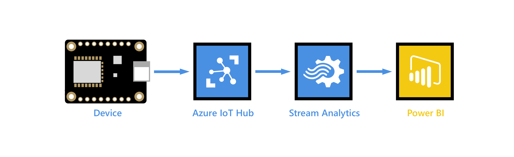

# Wio Terminal Air Quality Monitor
A Seeed Studio Wio Terminal air quality + temperature and humidity sample

## Overview
Original code was developed by [Salman Faris](https://www.hackster.io/Salmanfarisvp/air-quality-monitoring-station-with-wio-terminal-6ef85f). I have created this repo as an update to the original project that adds Azure IoT Hub to turn this into an IoT solution leveraging Azure Cloud for real-time message processing, dashboards, and analytics.

## Hardware
The hardware used for this project includes:

- [Seeed Studio Wio Terminal](https://wiki.seeedstudio.com/Wio-Terminal-Getting-Started/)
- [Seeed Studio Grove Multichannel Gas Sensor v2](https://wiki.seeedstudio.com/Grove-Multichannel-Gas-Sensor-V2/)
- [Seeed Studio Grove DHT11 Temperature and Pressure Sensor](https://wiki.seeedstudio.com/Grove-TemperatureAndHumidity_Sensor/)

## Azure Services 
The project uses the following Azure solutions:

- [Azure IoT Hub](https://learn.microsoft.com/en-us/azure/iot-hub/iot-concepts-and-iot-hub)
- [Azure Stream Analytics](https://learn.microsoft.com/en-us/azure/stream-analytics/stream-analytics-introduction)
- [Power BI](https://learn.microsoft.com/en-us/power-bi/?culture=en-us&country=us)

## Architecture
The architecture for this examples is taken from Microsoft Learn Tutorial: [Visualize real-time sensor data from Azure IoT Hub using Power BI](https://learn.microsoft.com/en-us/azure/iot-hub/iot-hub-live-data-visualization-in-power-bi).

This simple solution will stream the sensor telemetry from the Wio Terminal to Azure IoT Hub. This telemetry will include:

- Temperature
- Humididty
- Volatile organic compounds (VOC)
- Carbon monoxide (CO)
- Nitrogen dioxide (NO2)
- Ethyl alcohol (Ethyl)

The telemetry from IoT hub will be processed in real-time by Azure Stream Analytics and sent to Power BI to create a real time dashboard showing the telemetry from the sensors.

Additionally, we will send the telementry to Azure Blob Storage for long term cold storage and analytics processing.

## Source Code
I have decided to build and distribute this project using the Arduino IDE as it is one of the most popular programming environments for basic IoT projects. You can use this code and pull it into other solutions like PlatformIO and Visual Studio Code. All libraries reequired for this project to work are documented in the code with links on where to find the libraries if the are not included in the Arduino IDE.

At the time publishing this project, I am using Arduino IDE v2.x and have not tested it with Arduino IDE 1.8.x.